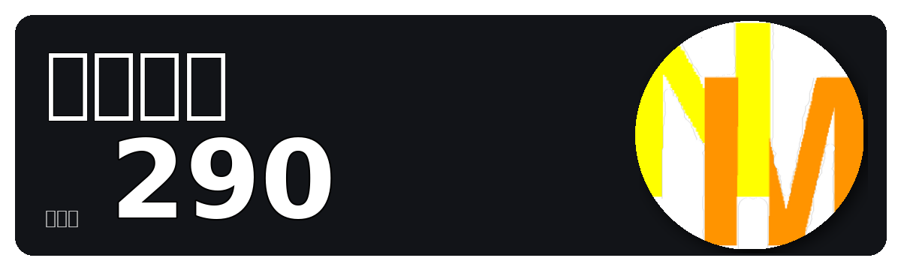

# Student living in Japan 👋


### Hi, I'm nisimodo
### I'm a 19-year-old programmer
### Please feel free to contact me anytime 👍

#


[](https://twitter.com/nisiomodoki)
[](https://twitter.com/nisimodo)

---

# About Me

- 🔥 Student based in Japan
- 💻 Mainly using C / HTML / CSS / Scratch
- 🎬 Enjoy editing videos with YMM4
- 📺 Posting Yukkuri skits and gameplay videos on YouTube

---

# Connect with Me

<p align="left">
  <a href="https://twitter.com/nisiomodoki" target="_blank">
    
  </a>

  <a href="https://twitter.com/nisimodo" target="_blank">
    
  </a>

  <a href="https://youtube.com/@nisimodo" target="_blank">
    
  </a>

  <a href="https://youtube.com/@nisimodo_sub" target="_blank">
    
  </a>

  <a href="mailto:nisiomodoki240@gmail.com">
    
  </a>
</p>

---

# Youtube



---

# My Skills


### Other Skills / Tools

- Scratch
- Maya
- Autdesk Fusion360
- ゆっくりMovie Maker4
- AviUtl

---

# Currently Learning


---

# Development Environment

```txt
OS        : Windows / mac
Editor    : VSCode
Database  : MySQL
